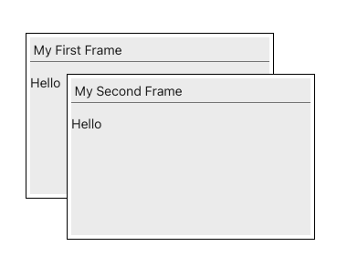

# react-better-frames

A user-friendly windowing system for React applications.

## Demo

An easy-to-understand interactive demo can be found here:

https://billdestein.github.io/react-better-frames-demo/

The source code for the demo is here:

https://github.com/billdestein/react-better-frames-demo

## Key Concepts

The following paragraphs will walk you through developing a very simple windowed React application called 'Hello'.

Key concepts include the container div, the Canvas and the Frame.

The container div is what it sounds like.  It's a generic div, typically a large div, that will contain some number of Frames.  The container div must be assigned an Id that is globally unique.  

Canvas is a Typescript class.  An application typically creates a single instance of the Canvas class.  The Canvas constructor takes a single argument, and that is the ID of the container div.  Once the Canvas instance is create, it is used to add frames to the container div, remove frames from the container div, and to manage many other features.

A Frame can be thought of as a miniature React app.  Each frame can have its own user experience, and its own business logic.  A frame is implemented as a React function component that returns an element of type React.JSX.Element.

# Getting Started

This guide will walk you through setting up a new React project configured with TypeScript using the officially supported create-react-app tool.

### Prerequisites
Make sure you have Node.js installed on your system, which includes npm (Node Package Manager).

### Step 1: Create a New Project

Using your terminal, navigate to the directory where you want to create your project and run the following command. The key is to include the --template typescript flag.

```bash
    npx create-react-app hello-app --template typescript
```

### Step 2: Wait for Installation

The command will create a new directory, download all necessary dependencies (React, ReactDOM, TypeScript, Webpack, Babel, etc.), and set up the project structure. This might take a few minutes.  

### Step 3: Navigate to Your Project Directory

Using your terminal, change your current directory to your new project folder:

```bash
   cd hello-app
```

### Step 4: Project Structure

At this point, your project structure will look similar to a standard JavaScript React app, but with some key differences:

```
hello-app/
├── node_modules/
├── public/
├── src/
│   ├── App.css
│   ├── App.tsx          <-- TypeScript React component file
│   ├── App.test.tsx     <-- TypeScript test file
│   ├── index.css
│   ├── index.tsx        <-- Entry point of your app, uses TypeScript
│   ├── react-app-env.d.ts <-- TypeScript declaration file
│   ├── reportWebVitals.ts
│   └── setupTests.ts
├── .gitignore
├── package.json
├── package-lock.json
└── tsconfig.json        <-- TypeScript configuration file
```

Note 1:  The .tsx extension indicates a file containing TypeScript code and JSX.

Note 2: The tsconfig.json file contains all the compiler options for your TypeScript project.
You are now ready to start building your application with the benefits of TypeScript's static type checking!

## Creating Your First Frame

### Steo 1: Install NPM packages

Using your terminal, cd to your hello-app directory, and run:

```
    npm install @billdestein/react-better-frames styled-components
```

Navigate to the src directory:

```
    cd src
```

Create an empty Hello.tsx file:

```
    touch Hello.tsx    
```

### Step 2: Edit Hello.tsx

Using your favorite code editor, open the newly create Hello.tsx file.  Paste the following code into the file and save the file.

```typescript

import React from 'react'
import { Canvas, Frame, FrameProps } from '@billdestein/react-better-frames'
import styled from 'styled-components'

const HelloFrame = (frameProps: FrameProps) => {
  const { canvas, geometry, message } = frameProps
  
  return (
    <Frame
      buttons={[]}
      canvas={canvas as Canvas}
      geometry={geometry}
      onResize={() => {}}
      title={message.title}
    >
      <p>Hello</p>
    </Frame>
  )
}

const app = (canvas: Canvas) => {
  canvas.addComponent(HelloFrame, { title: 'My First Frame' })
  canvas.addComponent(HelloFrame, { title: 'My Second Frame' })
}

export const Hello = () => {
  const ready = () => {
    const element = document.getElementById('container-id')
    const canvas = new Canvas(element)
    app(canvas)
  }

  return (
    <div ref={ready} style={{ height: '100vh' }} id="container-id"/>
  );
}
```

### Step 3: Edit App.tsx

Again, using your favorite code editor, open the App.tsx file.  Replace the content of the file with the code here:

```typescript
import React from 'react';
import './App.css';
import { Hello } from './Hello'

function App() {
  return (
    <Hello/>
  );
}

export default App;
```

### Start the Development Server

Navigate to the root of your project:

```
    cd ..
```

and then:

```typescript
    npm run start
```

This command will open a window in your default browser, pointing to http://localhost:3000.
The web page should look like this:



## Understanding Hello.tsx

Here we will examine the file Hello.tsx.  We will start at the bottom of the file and progress upward.

### The Hello function component

The purpose of the Hello function is to:

1) Render the container div.
2) Wait until the container div has been rendered into the DOM.
3) Create an instance of the Canvas class (passing the id of the container div).
4) Call the app function, passing the newly created Canvas object.

Note that there are multiple ways to wait for a React component to be fully rendered.  The authors prefer the use of callback refs -- which is now considered an anti-pattern.  The more mainstream approach is to use React hooks useEffect, useRef and useState.

### The app function

The app function performs application-wide initialization, and then uses the Canvas object to create frames.  Note that frames can be created and destroyed at any time during the app lifecycle.  They don't need to be created at app initialization time.

### The HelloFrame function component

The HelloFrame function component implements what we call a "frame".  Each frame can have its own user experience and its own business logic.  An app may have many different types of frames.  Note that a single frame can instantiate one or more child frames, and communicate with them using message passing and callbacks.


